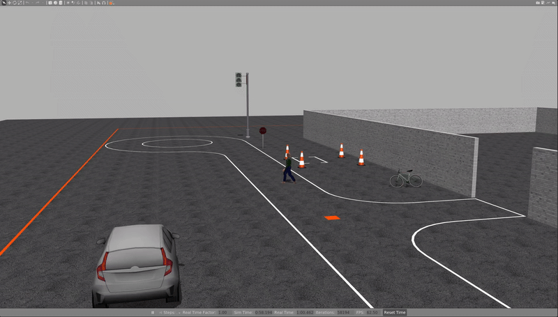

### Digital Twin Simulator for Polaris GEM e2 and e4 vehicles in University of Illinois Urbana-Champaign

This simulator was initially developed by Hang Cui for e2. It is currently under development with the addition and testing of the e4 model using [GEMstack](https://github.com/krishauser/GEMstack) for research and teaching at University of Illinois at Urbana-Champaign.  

| Polaris GEM e2 Vehicle                                                | Polaris GEM e4 Vehicle                                                |
| --------------------------------------------------------------------- | --------------------------------------------------------------------- |
| <a href="https://publish.illinois.edu/robotics-autonomy-resources/gem-e2/"></a> | <a href="https://publish.illinois.edu/robotics-autonomy-resources/gem-e4/"></a> |

## Table of Contents
- [Creating a Workspace](#creating-a-workspace)
- [Running the stack on Ubuntu 20.04 or 22.04 with Docker](#running-the-stack-on-ubuntu-2004-or-2204-with-docker)
  - [Prerequisites](#prerequisites)
  - [Building the Docker image](#building-the-docker-image)
  - [Running the Docker container](#running-the-docker-container)
  - [Usage Tips and Instructions](#usage-tips-and-instructions)
  - [Stopping the Docker container](#stopping-the-docker-container)
- [Building the Simulator and its packages](#building-the-simulator-and-its-packages)
- [Running the Simulator](#running-the-simulator)
- [Vehicle Selection](#vehicle-selection)
  - [E4 Vehicle (Default)](#e4-vehicle-default)
  - [Custom Scene](#custom-scene)
    - [Using Custom Scene Feature](#using-custom-scene-feature)
    - [Creating Custom YAML Configuration Files](#creating-custom-yaml-configuration-files)
    - [Example Configuration Format](#example-configuration-format)
    - [Example Usage](#example-usage)
  - [High Bay 3D Environment](#high-bay-3d-environment)
  - [E2 Vehicle](#e2-vehicle)
    - [Track1 Environment](#track1-environment)
    - [Demo of Pure Pursuit Controller](#demo-of-pure-pursuit-controller)
    - [Demo of Stanley Controller](#demo-of-stanley-controller)
    - [Track2 Environment](#track2-environment)
    - [Example Environment](#example-environment)
    - [Highbay Environment](#highbay-environment)
- [Utils Scripts](#utils-scripts)
  - [set\_pos.py](#set_pospy)
  - [generate\_waypoints.py](#generate_waypointspy)

## Creating a Workspace

Before building the Docker image, you need to create a ROS workspace and clone this repository into it. Follow these steps:

1. Create a new ROS workspace directory:
```bash
mkdir -p ~/gem_simulation_ws/src
cd ~/gem_simulation_ws
```

2. Clone the repository into the src folder:
```bash
cd src
git clone https://github.com/harishkumarbalaji/POLARIS_GEM_Simulator.git
cd POLARIS_GEM_Simulator
```

3. Once you have set up the workspace, you can proceed with building the Docker image as described below.

## Running the stack on Ubuntu 20.04 or 22.04 with Docker
> [!NOTE]
> Make sure to check the Nvidia Driver and supported CUDA version before proceeding by following the steps in the previous section.

#### Prerequisites
- Docker (In Linux - Make sure to follow the post-installation steps from [here](https://docs.docker.com/engine/install/linux-postinstall/))
- Nvidia Container Toolkit

Try running the sample workload from the [NVIDIA Container Toolkit](https://docs.nvidia.com/datacenter/cloud-native/container-toolkit/latest/sample-workload.html) to check if your system is compatible.

```bash
sudo docker run --rm --runtime=nvidia --gpus all ubuntu nvidia-smi
```

You should see the nvidia-smi output similar to [this](https://docs.nvidia.com/datacenter/cloud-native/container-toolkit/latest/sample-workload.html#:~:text=all%20ubuntu%20nvidia%2Dsmi-,Your%20output%20should%20resemble%20the%20following%20output%3A,-%2B%2D%2D%2D%2D%2D%2D%2D%2D%2D%2D%2D%2D%2D%2D%2D%2D%2D%2D%2D%2D%2D%2D%2D%2D%2D%2D%2D%2D%2D%2D%2D%2D%2D%2D%2D%2D%2D%2D%2D%2D%2D%2D%2D%2D%2D%2D%2D%2D%2D%2D%2D%2D%2D%2D%2D%2D%2D%2D%2D%2D%2D%2D%2D%2D%2D%2D%2D%2B%0A%7C%20NVIDIA%2DSMI%20535.86.10).

If you see the output, you are good to go. Otherwise, you will need to install the Docker and NVidia Container Toolkit by following the instructions. 
- For **Docker**, follow the instructions [here](https://docs.docker.com/engine/install/ubuntu/#install-using-the-repository).
  
- For **Nvidia Container Toolkit**, run `setup/get_nvidia_container.sh` from this directory to install, or see [this](https://docs.nvidia.com/datacenter/cloud-native/container-toolkit/latest/install-guide.html) for more details.

#### Building the Docker image

To build a Docker image with all these prerequisites, you can use the provided Dockerfile by running.

> [!IMPORTANT]
> Do not run the Docker scripts (`build_docker_image.sh`, `run_docker_container.sh`, `stop_docker_container.sh`) with `sudo`. Instead, follow the [post-installation steps](https://docs.docker.com/engine/install/linux-postinstall/) to allow non-root users to run Docker commands.

```bash
bash setup/build_docker_image.sh
```

#### Running the Docker container

To run the container, you can use the provided Docker Compose file by running.
> [!NOTE]
> If you want to open multiple terminals to run the container, you can use the same command. It will automatically start a new terminal inside the same container.
```bash
bash run_docker_container.sh
```

#### Usage Tips and Instructions

##### Using Host Volume

You can use the host volume under the container's home directory inside the `<username>` folder. This allows you to build and run files that are on the host machine. For example, if you have a file on the host machine at `/home/<username>/project`, you can access it inside the container at `/home/<username>/host/project`.

##### Using Dev Containers Extension in VSCode

To have a good developer environment inside the Docker container, you can use the Dev Containers extension in VSCode. Follow these steps:

1. Install the Dev Containers extension in VSCode.
2. Open the cloned repository in VSCode.
3. Press `ctrl+shift+p`(or select the remote explorer icon from the left bar) and select `Dev-Containers: Attach to Running Container...`.
4. Select the container name `gem_stack-container`.
5. Once attached, Select `File->Open Folder...`.
6. Select the folder/workspace you want to open in the container.

This will set up the development environment inside the Docker container, allowing you to use VSCode features seamlessly.

#### Stopping the Docker container

To stop the container, you can use the provided stop script by running.

```bash
bash stop_docker_container.sh
```

## Building the Simulator and its packages

To build the simulator and its packages, you can use the provided docker run script and then navigating to the place your simulator workspace is located and then build using,
> [!NOTE]
> Make sure you have cloned this repository inside the `src` folder of your simulator workspace before building the packages.

```bash
cd <path_to_your_simulator_workspace>
# You should see the src folder inside your simulator workspace
catkin_make
```

## Running the Simulator

The simulator supports both Polaris GEM e4 (default) and GEM e2 vehicles. You can select which vehicle to use when launching the simulator.

## Vehicle Selection

### E4 Vehicle (Default)
The simulator now uses the E4 vehicle by default. To run with the default E4 vehicle in the parking world:

```bash
source devel/setup.bash
roslaunch gem_launch gem_init.launch world_name:=parking.world x:=-9.4 y:=-5.7 yaw:=220
```

<a href="url"></a>

### Custom Scene

The simulator supports custom scenes with static objects (cones, signs, etc.) and dynamic agents (pedestrians, bicycles, cars) using YAML configuration files.

#### Using Custom Scene Feature

To enable the custom scene feature, set the `custom_scene` parameter to `true` when launching the simulator.

This will automatically load the corresponding YAML configuration file (e.g., `highbay_track.yaml`) from the `gem_gazebo/scenes/` directory.

#### Creating Custom YAML Configuration Files

The YAML configuration file consists of two main sections:
1. `objects`: Static items placed in the scene (cones, signs, etc.)
2. `agents`: Dynamic entities that can move (pedestrians, vehicles, etc.)

The file should be placed in the `gem_gazebo/scenes/` directory with the same base name as your world file.

#### Example Configuration Format:

```yaml
# Static objects section
objects:
  - name: cone1
    source: {type: fuel, uri: "https://fuel.gazebosim.org/1.0/OpenRobotics/models/Construction%20Cone"}
    xyz: [x, y, z]
    rpy: [roll, pitch, yaw]
    static: false  # Set to false to enable physics, true to keep static (default: false)
  
  - name: traffic_light
    source: {type: mesh, uri: "model://traffic_light/meshes/traffic_light.dae", scale: [0.3, 0.3, 0.3]}
    xyz: [x, y, z]
    rpy: [roll, pitch, yaw]
    static: true  # Keep this object fixed in place
    
  - name: stop_sign
    source: {type: sdf, uri: "model://stop_sign"}
    xyz: [x, y, z]
    rpy: [roll, pitch, yaw]
    static: true  # Keep this object fixed in place

# Dynamic agents section
agents:
  # Animated pedestrian (uses Gazebo actor with animation)
  - name: pedestrian1
    source: {type: fuel, uri: "https://fuel.gazebosim.org/1.0/OpenRobotics/models/Walking%20Person"}
    trajectory:
      - [time, x, y, z, roll, pitch, yaw] # First waypoint
      - [time, x, y, z, roll, pitch, yaw] # Second waypoint

  # Rigid motion vehicle (kinematically moved)
  - name: bicycle1
    motion: rigid
    source: {type: fuel, uri: "https://fuel.gazebosim.org/1.0/athackst/models/bicycle"}
    trajectory:
      - [time, x, y, z, roll, pitch, yaw] # First waypoint
      - [time, x, y, z, roll, pitch, yaw] # Second waypoint
      # Add more waypoints as needed
```

#### Configuration Parameters

Both objects and agents share these common source types:
- `fuel`: Models from Gazebo Fuel (e.g., "https://fuel.gazebosim.org/...")
- `sdf`: Complete model references (e.g., "model://stop_sign")
- `mesh`: Direct mesh files (e.g., "model://traffic_light/meshes/traffic_light.dae")

**For static objects:**
- Require `name`, `source`, position (`xyz`), and orientation (`rpy`) in radians
- Only mesh files support the `scale` parameter as [scale_x, scale_y, scale_z]
- Optional `static` parameter:
  - `static: false` (default) - Object has physics enabled, can be moved/knocked over during simulation
  - `static: true` - Object is fixed in place, no physics applied

**For dynamic agents:**
- `motion: rigid` - Required for vehicles/objects (not needed for pedestrians)
- Pedestrians use Gazebo's native actor animation
- All require `trajectory` points in format: `[time, x, y, z, roll, pitch, yaw]`
- Time values indicate when the agent should reach each waypoint
- Trajectories loop continuously

#### Example Usage

See the `highbay_track.yaml` file in the `gem_gazebo/scenes/` directory for a complete example.
```bash
source devel/setup.bash
roslaunch gem_launch gem_init.launch world_name:="highbay_track.world" x:=12.5 y:=-21 yaw:=3.1416 custom_scene:=true
```



### High Bay 3D Environment

To use the 3D mesh model of the High Bay environment:

1. **Download Resources**: Download the 3D mesh files from [this link](https://drive.google.com/file/d/1BF-EK3Bs4y98xDiH_Li8zG2p62vckI-k/view?usp=sharing)

2. **Install Files**: 
   - Extract the downloaded zip file
   - Place the extracted `high_bay_3d` folder inside the `gem_gazebo/models` directory
   - Make sure the folder contains the `.dae` file and associated texture files (`.png` files)

3. **Launch the Environment**:
```bash
source devel/setup.bash
roslaunch gem_launch gem_init.launch world_name:="high_bay_3d.world" x:=17.81 y:=-10 yaw:=3.14
```

### E2 Vehicle
To use the E2 vehicle instead, set the parameter `vehicle_name` to `e2`:

### Example Environment and their launch commands
#### Track1 Environment

```bash
source devel/setup.bash
roslaunch gem_launch gem_init.launch world_name:="track1.world" vehicle_name:=e2
```

```bash
source devel/setup.bash
roslaunch gem_launch gem_sensor_info.launch
```

<a href="url"></a>

<a href="url"></a>

##### Demo of Pure Pursuit Controller

```bash
source devel/setup.bash
roslaunch gem_launch gem_init.launch world_name:="track1.world" vehicle_name:=e2
rosrun gem_pure_pursuit_sim pure_pursuit_sim.py
```

<a href="url"></a>

##### Demo of Stanley Controller

```bash
source devel/setup.bash
roslaunch gem_launch gem_init.launch world_name:="track1.world" vehicle_name:=e2
rosrun gem_stanley_sim stanley_sim.py
```

<a href="url"></a>

<a href="url"></a>

#### Track2 Environment

```bash
source devel/setup.bash
roslaunch gem_launch gem_init.launch world_name:="track2.world" vehicle_name:=e2 y:=-98.5
```

<a href="url"></a>

#### Example Environment

```bash
source devel/setup.bash
roslaunch gem_launch gem_init.launch vehicle_name:=e2
```

<a href="url"></a>

<a href="url"></a>

#### Highbay Environment

```bash
source devel/setup.bash
roslaunch gem_launch gem_init.launch world_name:="highbay_track.world" vehicle_name:=e2 x:=12.5 y:=-21 yaw:=3.1416
```

<a href="url"></a>

<a href="url"></a>

# Utils Scripts

## set_pos.py
To set the position and yaw of the vehicle, run the set_pos python script in the utils folder.
```bash
source devel/setup.bash
cd src/POLARIS_GEM_Simulator
  python3 utils/set_pos.py --x 12.5  --y -21 --yaw 3.1416 --vehicle gem_e4
```

will set the vehicle in a position where the loop is aligned with the highbay_backlot_p.csv

## generate_waypoints.py
To manually steer the car and record waypoints to a csv file, run

```bash
source devel/setup.bash
cd src/POLARIS_GEM_Simulator
python3 utils/generate_waypoints.py
```
The controls are: W/S - forward/back | A/D - left/right | R - start/stop waypoint recording | Q - quit

Yaypoints are recorded to a utils/waypoints/waypoints.csv directory.
The lattitude, longitude, and heading are recorded in start frame so that it can be used directly in gemstack
